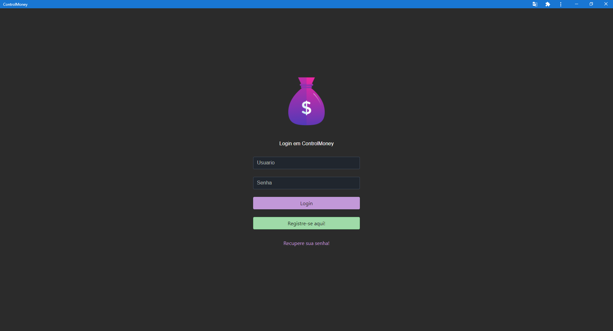

# ControlMoney

  <a href="#">
    
	&nbsp;
	
  </a>

## Escopo

Este projeto é uma aplicação Angular, PrimeNG e Progressive Web App (PWA).
O objetivo desta aplicação é ser uma ferramenta de auxilio no controle financeiro pessoal de cada usuário.
Através de telas intuitivas e a possibilidade de instala-lo diretamente no computador como um aplicativo.

Aplicação em desenvolvimento...

## Tecnologias

- angular cli: 10.0.1
- node: 14.16.1
- primeng: 11.3.0

## Como instalar

- Baixe ou clone este repositório usando `git clone https://github.com/geisonfeitosa/ControlMoney.git`.
- Dentro do diretório, execute `npm install` para instalar as dependências.

## Como executar

- Dentro do diretório, execute ng serve para executar a versão de desenvolvimento.
- Depois acesse http://localhost:4200/.

# ControlMoney
